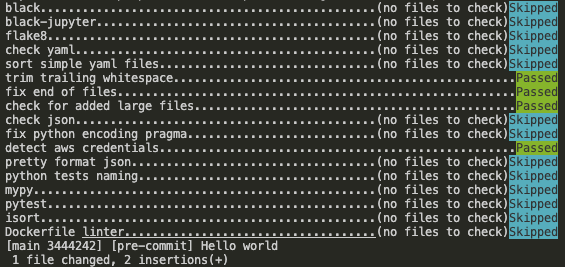

# 📕 pre-commit-setup
----------------------------------------------------------------
[](https://github.com/pre-commit/pre-commit)

After cloning the repo in your machine, load the conda environment
```shell
conda create --name my-env python=3.9 --file=environment.yml
```

Once the environment is installed, activate it via:
```shell
conda activate my-env
```

Install the git hook scripts
```shell
pre-commit install
```

Create a python file called `example_file.py` containing the following code:
```python
x = {  'a':37,'b':42,
'c':True}
if x['c'] is not None and \
 x['a'] > 0 or \
 x['b']  <= 214           :
 z = 'hello '+'world'
else:
 world = 'world'
 a = 'hello {}'.format(world)
 f = rf'hello {world}'
class Foo  (     object  ):
  def f    (self   ):
    return       37*-2
  def g(self, x,y=42):
      return y
# fmt: off
custom_formatting = [
    0,  1,  2,
    3,  4,  5,
    6,  7,  8,
]
```

Commit your work

```shell
git add .
git commit -m "Hello world"
```

Pre-commit will run all the hooks defined in `.pre-commit-config.yaml`. Once pre-commit will perform all the checks, you should see in your terminal something like this:


If you newly check `example_file.py` you will notice that the file has been modified as follows:

```python
# -*- coding: utf-8 -*-
x = {"a": 37, "b": 42, "c": True}
if x["c"] is not None and x["a"] > 0 or x["b"] <= 214:
    z = "hello " + "world"
else:
    world = "world"
    a = "hello {}".format(world)
    f = rf"hello {world}"


class Foo(object):
    def f(self):
        return 37 * -2

    def g(self, x, y=42):
        return y


custom_formatting = [
    0,
    1,
    2,
    3,
    4,
    5,
    6,
    7,
    8,
]
```

Commit the new changes:

```shell
git add .
git commit -m "[pre-commit] Hello world"
```



This time there are no <span style="color:red">Failed</span> tests and you can finally push your changes on github.

**Note**: in the case you want to avoid running pre-commit add the option `--no-verify` i.e.:
```shell
git commit --no-verify -m “commit my changes”
```

For more information about pre-commit check the [documentation](https://pre-commit.com).
